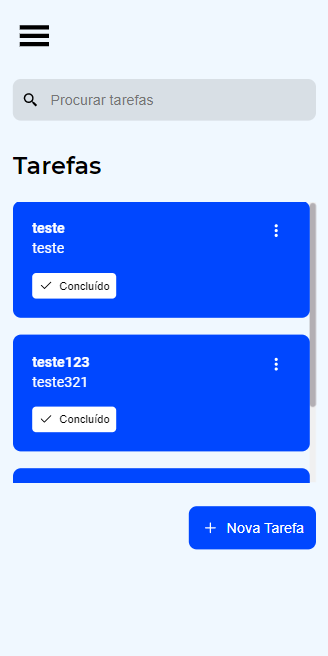
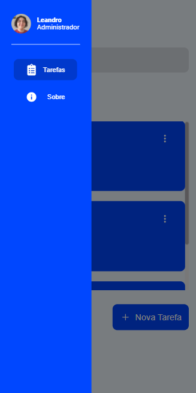
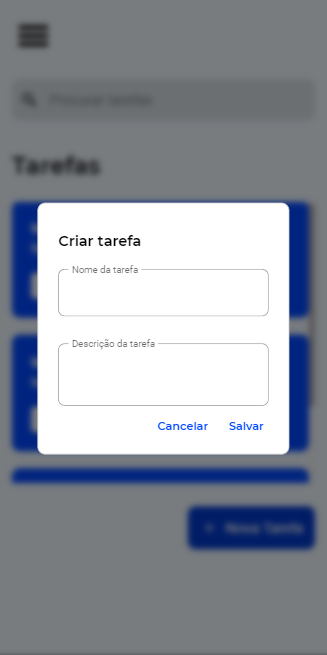
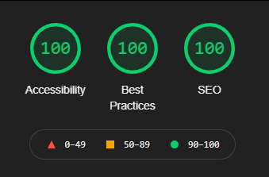
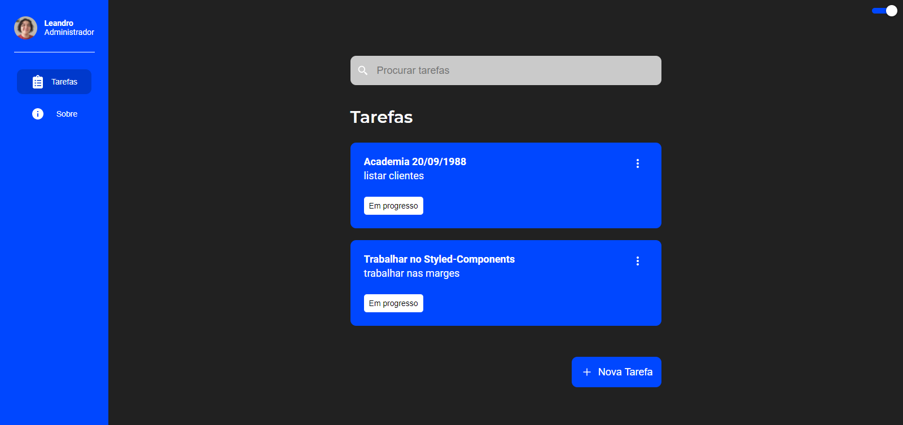
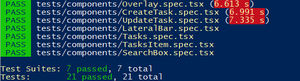

# Lista de tarefas 


<p align="middle">
  
  
  
</p>

## Objetivo

O objetivo foi criar uma lista de tarefas com um código bem escrito para facilitar a manutenção do código.

## 🛠 Tecnologias

Foi utilizada as tecnologias mais modernas como:

- [nextjs](https://nextjs.org/)
- [redux toolkit](https://redux-toolkit.js.org/)
- [typescript](https://www.typescriptlang.org/)
- [react hook form](https://react-hook-form.com/)
- [framer motion](https://www.framer.com/motion/)

## desafios

O principal desafio enfrentado foi criar um site com o máximo de funcionalidades possíveis e com todos os recursos possíveis para facilitar a manutenção do código.

## SEO

O site foi construído usado as melhores práticas de [SEO](https://pt.wikipedia.org/wiki/Otimiza%C3%A7%C3%A3o_para_motores_de_busca) e de acessibilidade.



## Theme switch

Foi adicionado um theme switch para aqueles que preferem o **tema dark**. Com o  [redux-persist](https://github.com/rt2zz/redux-persist) o tema escolhido fica salvo mesmo depois da pagina ser fechada.



## 🎯Testes



💡 Para executar os testes utilize o comando ```yarn test```

Os testes foram adicionados para garantir que mesmo depois de alguma alteração do código continuaria funcionando. Os testes foram feitos utilizando [Jest](https://jestjs.io/pt-BR/). Os componentes testados foram:

- Modal
  - CreateTask
  - UpdateTask
  - DeleteTask
- LateralBar
- Overlay
- SearchBox
- Tasks
- TaskItem

## 🚀 Como executar o projeto

### Pré-requisitos

Antes de começar, você vai precisar ter instalado em sua máquina as seguintes ferramentas:

- [git](https://git-scm.com/)
- [nodejs](https://nodejs.org/en/)
- [npm](https://nodejs.org/en/) ou [yarn](https://yarnpkg.com/)

## 🧭 Rodando a aplicação

```bash
# Clone este repositório
$ git clone https://github.com/Leandro-Goncalves/wls-to-do

# Acesse a pasta do projeto no seu terminal/cmd
$ cd wls-to-do

# Instale as dependências
$ npm install
# ou
$ yarn

# Execute a aplicação em modo de desenvolvimento
$ npm run dev
# ou
$ yarn dev

# A aplicação será aberta na porta:3000 - acesse http://localhost:3000
```
